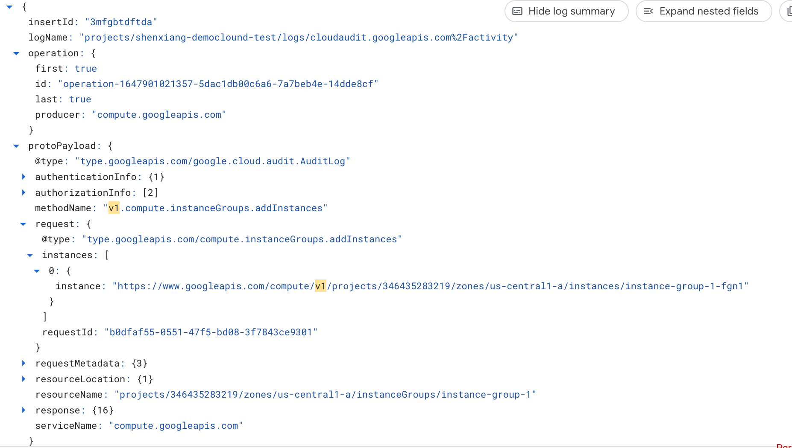
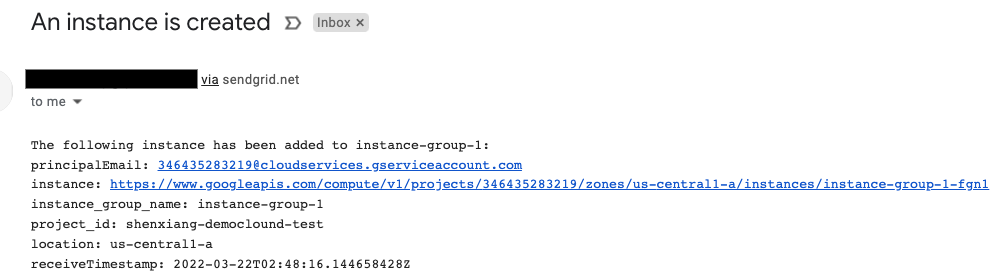

# Compute Engine VM event notification - Cloud Functions

In this sample, you'll build a Cloud Functions service that receives an event
when a Compute Engine VM instance is created in an instance group.
The event is sent via Eventarc. In response, the Cloud Function
sends a notification.

## Determine newly created Compute Engine VMs

Compute Engine emits an AuditLogs when a VM is added in the instance group.

The event looks like this:




## Before you begin

Before deploying the service and trigger, go through some setup steps.

### Enable APIs

Make sure that the project id is setup:

```sh
gcloud config set project [YOUR-PROJECT-ID]
PROJECT_ID=$(gcloud config get-value project)
```

Enable all necessary services:

```sh
gcloud services enable artifactregistry.googleapis.com
gcloud services enable cloudfunctions.googleapis.com
gcloud services enable run.googleapis.com
gcloud services enable eventarc.googleapis.com
gcloud services enable cloudbuild.googleapis.com
```

Grant the eventarc.eventReceiver role to the project's Compute Engine service account:

```sh
PROJECT_NUMBER=$(gcloud projects list --filter="project_id:$PROJECT_ID" --format='value(project_number)')

gcloud projects add-iam-policy-binding $PROJECT_ID \
  --member serviceAccount:$PROJECT_NUMBER-compute@developer.gserviceaccount.com \
  --role roles/eventarc.eventReceiver
```

### Enable Audit Logs

You will use [Audit Logs](https://console.cloud.google.com/iam-admin/audit)
trigger for Compute Engine. Make sure `Admin Read`, `Data Read`, and `Data Write`
log types are enabled for Compute Engine.

## GCE VM Instnace Event Notifier

This service receives AuditLogs for service `compute.googleapis.com` and
method `v1.compute.instanceGroups.addInstances` to detect newly initialized
instances due to the repaired process in an instance group. 

The source code of the service is in [python](python).

Deploy the service with the deploy script [python/deploy.sh](python/deploy.sh):

```sh
./deploy.sh
```

See that the service is deployed:

```sh
gcloud functions list
```

## Trigger

> **Note:** Although your Audit Log function trigger will be created
> immediately, it can take up to 10 minutes for the trigger to be active.

Once the service is deployed, a trigger is created under the covers.

Make sure the trigger is ready by checking the `ACTIVE` flag:

```sh
gcloud eventarc triggers list
```

## Result
With an approperate setup with [Sendgrid](https://sendgrid.com/), you will receive 
emails like the following when new instances are added to an instance group:

